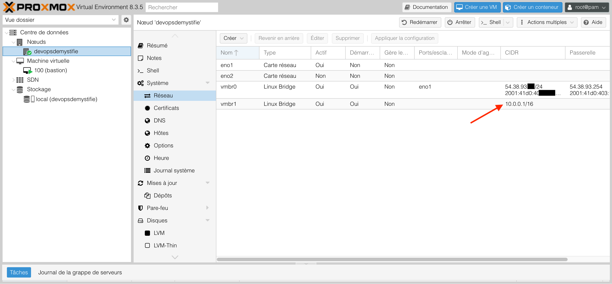
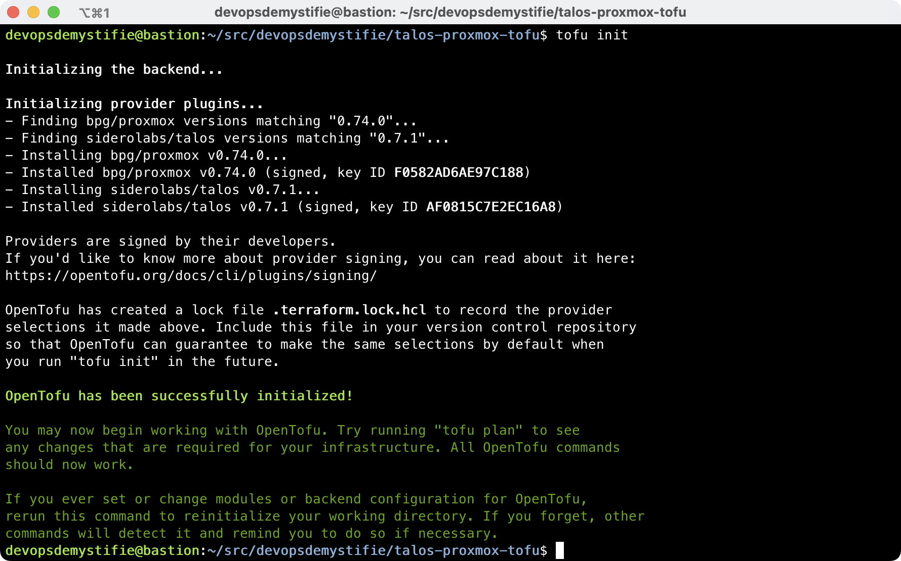
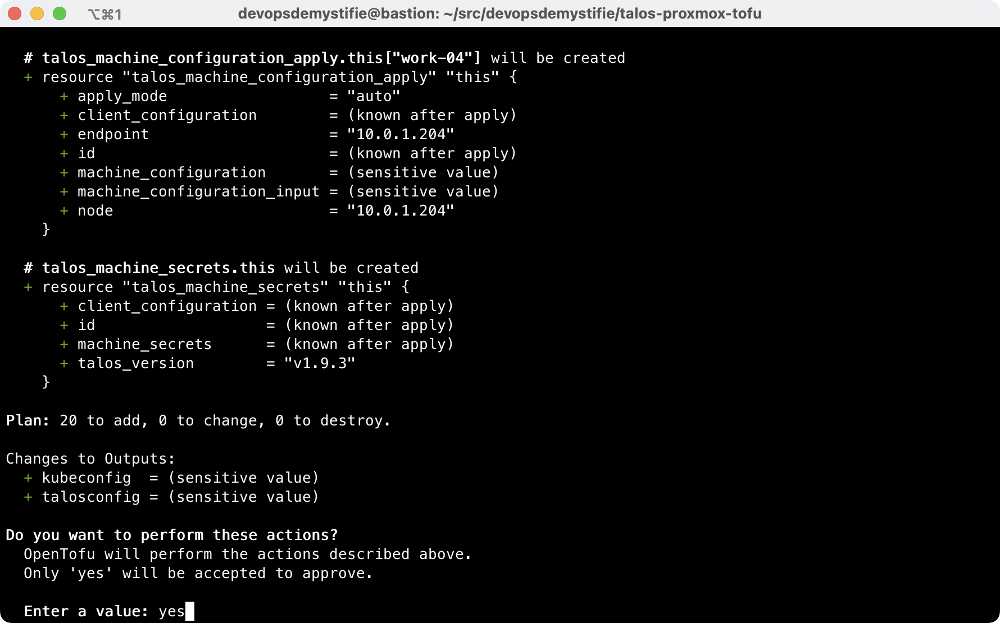
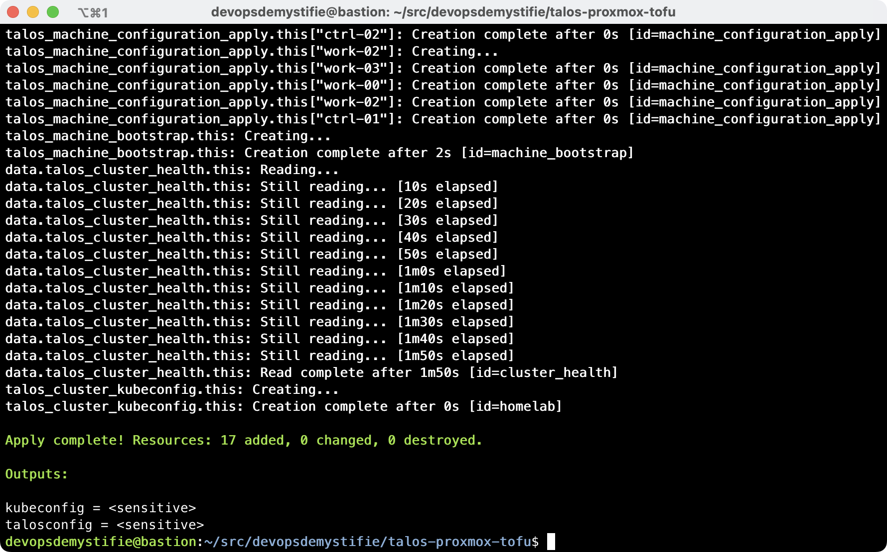
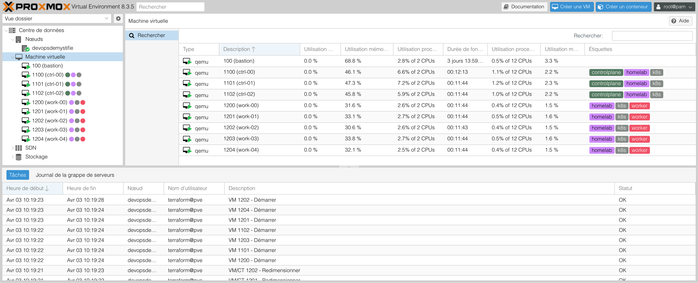

---
categories:
- proxmox
description: Mise en place d'un cluster sur un serveur Proxmox
title: Installation du k8s sur Proxmox
linkTitle: K8s sur Proxmox
weight: 1

authors:
- Jacint BALINT
---

### Objectif

L'objectif de cet article est de présenter l'automatisation de la création d'un cluster Kubernetes sur un serveur Proxmox, en fournissant un environnement de développement et de test fiable et reproductible.

### Installation Proxmox

Vous pouvez utiliser une machine ancienne qui ne vous sert plus, mais si vous n'en avez pas (et c'est mon cas), il est possible de louer un serveur chez OVH. Assurez-vous que la machine dispose d'au moins 32 Go de RAM et d'un SSD pour des performances optimales.

Une fois le serveur était prêt sur OVH, j'ai installé Proxmox à partir du site web de gestion : www.ovh.com/manager. La version 8 est disponible, et j'ai pu configurer la partition (RAID, etc.) avant l'installation.

J'ai configuré une interface réseau de type `bridge` nommée `vmbr1` pour relier les machines virtuelles éventuelles. J'ai utilisé un CIDR assez large (/16) afin d'avoir suffisamment d’adresses IP disponibles.



J'ai créé une machine virtuelle avec Debian, que j'ai nommée `bastion`. Cette machine me permet de me connecter aux machines virtuelles qui seront bientôt déployées pour constituer le cluster Kubernetes.

### Préparation du serveur Proxmox pour l'automatisation

Afin que OpenTofu (ou Terraform) puisse gérer le serveur Proxmox, il faut créer deux comptes. L'API de Proxmox 8 étant limitée, le provider `bpg/proxmox` utilise à la fois l'API et une connexion SSH avec `sudo` pour les tâches non disponibles via l'API. On va donc créer un compte PVE et un compte Linux, puis configurer les privilèges au sein de Proxmox ainsi que via l'interface SSH.

#### Configuration de l'utilisateur PVE

On se connecte à la machine Proxmox via le CLI en tant qu'utilisateur "root".

D'abord, on crée le rôle :

```bash
pveum role add TerraformRole -privs "Datastore.Allocate Datastore.AllocateSpace Datastore.Audit Datastore.AllocateTemplate Pool.Allocate Sys.Audit Sys.Console Sys.Modify VM.Allocate VM.Audit VM.Clone VM.Config.CDROM VM.Config.Cloudinit VM.Config.CPU VM.Config.Disk VM.Config.HWType VM.Config.Memory VM.Config.Network VM.Config.Options VM.Console VM.Migrate VM.Monitor VM.PowerMgmt SDN.Use"
```

Puis on crée l'utilisateur PVE, créé un mot de passe et attribue le rôle :

```bash
pveum user add terraform@pve -comment "Terraform user"
pveum passwd terraform@pve
pveum aclmod / -user terraform@pve -role TerraformRole
```

Nous aurons besoin d'un jeton :

```bash
pveum user token add terraform@pve terraform -expire 0 -privsep 0 -comment "Terraform token"
```

Il est important de sauvegarder le jeton, car il ne sera affiché qu'une seule fois.

#### Configuration de l'utilisateur Linux

Proxmox nécessite une connexion SSH pour les commandes qui ne sont pas encore disponibles via l’API.

On reste connecté à la machine Proxmox en tant que "root". On crée l'utilisateur :

```bash
useradd -m terraform
```

On doit autoriser certaines commandes qui sont nécessaires pour les tâches :

```bash
visudo -f /etc/sudoers.d/terraform
```

On copie les privilèges dans l'éditeur :

```plain
terraform ALL=(root) NOPASSWD: /sbin/pvesm
terraform ALL=(root) NOPASSWD: /sbin/qm
terraform ALL=(root) NOPASSWD: /usr/bin/tee /var/lib/vz/*
```

Nous aurons besoin d'une clé SSH que OpenTofu utilisera pour se connecter sans mot se passe. On copie la clé publique dans le fichier `~/.ssh/authorized_keys` sous l'utilisateur récemment créé (par exemple `terraform`).

> [!NOTE]
> La clé privée doit être importée dans la mémoire de la machine qu'on utilisera pour executer les commandes terraform :
> ```bash
> eval $(ssh-agent)
> ssh-add ~/.ssh/id_ed25519
> ```

On peut alors tester la connexion depuis (par exemple) la machine virtuelle `bastion` :

```bash
ssh terraform@<proxmox-serveur> sudo pvesm apiinfo 
```

Si tout va bien, on aura la réponse suivante :

```bash
devopsdemystifie@bastion:~/src$ ssh terraform@10.0.0.1 sudo pvesm apiinfo
APIVER 10
APIAGE 1
```

### Installation des machines virtuelles

#### Variables

Une fois Proxmox installé et son API configurée, on peut aborder de l'automatisation de la création des machines virtuelles sur lesquelles nous allons installer notre cluster kubernetes.

On va définir les fichiers Terraform/OpenTofu.

D'abord on crée des variables pour passer nos secrets, certaines configurations, etc. Ce sera notre ficher `variables.tf` :

```hcl
# Variables pour le provider proxmox

variable "proxmox_endpoint" {
  description = "Proxmox API endpoint"
  type        = string
}

variable "proxmox_ssh_username" {
  description = "Utilisateur SSH pour le serveur Proxmox"
  type        = string
}

variable "proxmox_ssh_private_key_path" {
  description = "Emplacement de la clé SSH privée de l'utilisateur SSH"
  type        = string
}

variable "proxmox_insecure" {
  description = "Nécessaire si on utilise un certificat SSL auto-signé"
  type        = bool
}

variable "proxmox_api_token" {
  description = "Jeton API pour le serveur Proxmox"
  type        = string
}

variable "proxmox_datastore_id" {
  description = "Nom du répertoire sur le serveur Proxmox"
  type        = string
}

variable "proxmox_node_name" {
  description = "Nom du node Proxmox"
  type        = string
}

variable "proxmox_network_device" {
  description = "Nom de la carte de réseau virtuelle utilisée par les VMs du cluster"
  type        = string
}

```

Pour accéder facilement aux variables, on peut utiliser l'application [direnv](https://direnv.net), qui gère les variables d'environnement chaque fois que l'on entre dans un répertoire et les efface de la mémoire quand on le quitte. Suivez les instructions d'installation et de configuration de l'outil, puis créez le fichier `.envrc` :

```bash
# On peut utiliser direnv pour gérer les variables d'environment.

export TF_VAR_proxmox_endpoint="https://<le serveur proxmox>:8006/"
export TF_VAR_proxmox_insecure="true"
export TF_VAR_proxmox_api_token="terraform@pve!terraform=<clé API>"
export TF_VAR_proxmox_ssh_username="terraform"
export TF_VAR_proxmox_ssh_private_key_path="~/.ssh/terraform-id_ed25519"

export TF_VAR_proxmox_datastore_id="local"
export TF_VAR_proxmox_node_name="pve"
export TF_VAR_proxmox_network_device="vmbr1"

export TF_VAR_cluster_name="homelab"
export TF_VAR_talos_version="v1.9.3"
export TF_VAR_kubernetes_version="1.32.0"
```

> [!IMPORTANT]
> N'oubliez pas de créer `.gitignore` et de préciser le fichier `.envrc`, si vous utilisez un répertoire Git pour vos projets.
> Sinon, vous risquez de divulguer vos secrets.

#### Providers

Ensuite on précise les providers que l'on va utiliser dans le fichier `providers.tf` :

```hcl
terraform {
  required_providers {
    proxmox = {
      source  = "bpg/proxmox"
      version = "0.74.0"
    }
    talos = {
      source  = "siderolabs/talos"
      version = "0.7.1"
    }
  }
}

provider "proxmox" {
  endpoint  = var.proxmox_endpoint
  api_token = var.proxmox_api_token
  insecure  = var.proxmox_insecure

  ssh {
    agent       = true
    private_key = var.proxmox_ssh_private_key_path
    username    = var.proxmox_ssh_username
  }
}

provider "talos" {
}

```

#### Paramètres des machines virtuelles

On définit les paramètres des machines virtuelles à créer, voici notre fichier `main.tf`:

```hcl
locals {
  endpoint = "10.0.1.100"
  gateway  = "10.0.0.1"
  nodes = {
    "ctrl-00" = {
      machine_type  = "controlplane"
      vm_id         = 1100
      ip            = "10.0.1.100"
      cpu_cores     = 2
      ram_dedicated = 3072
    }
    "ctrl-01" = {
      machine_type  = "controlplane"
      vm_id         = 1101
      ip            = "10.0.1.101"
      cpu_cores     = 2
      ram_dedicated = 3072
    }
    "ctrl-02" = {
      machine_type  = "controlplane"
      vm_id         = 1102
      ip            = "10.0.1.102"
      cpu_cores     = 2
      ram_dedicated = 3072
    }
    "work-00" = {
      machine_type  = "worker"
      vm_id         = 1200
      ip            = "10.0.1.200"
      cpu_cores     = 2
      ram_dedicated = 3072
    }
    "work-01" = {
      machine_type  = "worker"
      vm_id         = 1201
      ip            = "10.0.1.201"
      cpu_cores     = 2
      ram_dedicated = 3072
    }
    "work-02" = {
      machine_type  = "worker"
      vm_id         = 1202
      ip            = "10.0.1.202"
      cpu_cores     = 2
      ram_dedicated = 3072
    }
    "work-03" = {
      machine_type  = "worker"
      vm_id         = 1203
      ip            = "10.0.1.203"
      cpu_cores     = 2
      ram_dedicated = 3072
    }
    "work-04" = {
      machine_type  = "worker"
      vm_id         = 1204
      ip            = "10.0.1.204"
      cpu_cores     = 2
      ram_dedicated = 3072
    }
  }
}
```

Il faut bien évidemment adapter ces fichiers pour chaque situation, notamment les adresses IP, etc.

Des machines `controlplane` et celles de `worker` définies, on peut avancer avec le fichier `virtual_machines.tf` :

```hcl
resource "proxmox_virtual_environment_vm" "this" {
  for_each = local.nodes

  node_name = var.proxmox_node_name

  name        = each.key
  description = each.value.machine_type == "controlplane" ? "Control Plane" : "Worker"
  tags        = each.value.machine_type == "controlplane" ? ["k8s", "controlplane", var.cluster_name] : ["k8s", "worker", var.cluster_name]
  on_boot     = true
  vm_id       = each.value.vm_id

  cpu {
    cores = each.value.cpu_cores
    type  = "x86-64-v2-AES"
  }

  memory {
    dedicated = each.value.ram_dedicated
  }

  agent {
    enabled = true
  }

  network_device {
    bridge = var.proxmox_network_device
  }

  disk {
    datastore_id = var.proxmox_datastore_id
    file_id      = proxmox_virtual_environment_download_file.talos_nocloud_image.id
    file_format  = "raw"
    interface    = "virtio0"
    size         = 20
  }

  operating_system {
    type = "l26" # Linux Kernel 2.6 - 5.X.
  }

  initialization {
    datastore_id = var.proxmox_datastore_id
    ip_config {
      ipv4 {
        address = "${each.value.ip}/16"
        gateway = local.gateway
      }
    }
    dns {
      servers = ["8.8.8.8"]
    }
  }
}
```

#### Disque de démarrage

Les machines virtuelles utiliseront une image de Talos Linux avec l'extension QEMU préinstallée.

> [!NOTE]
> Les images Talos étant immuables, il n'est pas possible d'installer des extensions une fois la machine lancée.
> J'ai utilisé la "[Talos Image Factory](https://factory.talos.dev)" pour choisir les extensions et
> récupérer le lien d'une image préconfigurée.

Voici notre fichier `files.tf` :

```hcl
resource "proxmox_virtual_environment_download_file" "talos_nocloud_image" {
  content_type = "iso"
  datastore_id = var.proxmox_datastore_id
  node_name    = var.proxmox_node_name

  file_name               = "talos-${var.talos_version}-nocloud-amd64.img"
  url                     = "https://factory.talos.dev/image/ce4c980550dd2ab1b17bbf2b08801c7eb59418eafe8f279833297925d67c7515/${var.talos_version}/nocloud-amd64.raw.gz"
  decompression_algorithm = "gz"
  overwrite               = false
}
```

> [!NOTE]
> Si vous avez besoin d'autres extensions, choisissez l'image "Disk Image" sur le site de la "Talos Factory" au lieu de l'ISO pour lancer les machines virtuelles.

### Configuration et bootstrap du cluster kubernetes

Nous avons configuré l'automatisation de la création des machines virtuelles en choisissant l'image de disque de base. Maintenant, nous allons configurer le système Talos Linux et procéder à son "bootstrap" pour créer un cluster Kubernetes.

#### Configuration du Talos Linux

Voici notre dernier fichier, `cluster.tf` :

```hcl
resource "talos_machine_secrets" "this" {
  talos_version = var.talos_version
}

data "talos_client_configuration" "this" {
  cluster_name         = var.cluster_name
  client_configuration = talos_machine_secrets.this.client_configuration
  nodes                = [for k, v in local.nodes : v.ip]
  endpoints            = [for k, v in local.nodes : v.ip if v.machine_type == "controlplane"]
}

data "talos_machine_configuration" "this" {
  for_each = local.nodes

  cluster_name       = var.cluster_name
  cluster_endpoint   = "https://${local.endpoint}:6443"
  machine_type       = each.value.machine_type
  machine_secrets    = talos_machine_secrets.this.machine_secrets
  talos_version      = var.talos_version
  kubernetes_version = var.kubernetes_version
}

resource "talos_machine_configuration_apply" "this" {
  depends_on = [proxmox_virtual_environment_vm.this]

  for_each = local.nodes

  client_configuration        = talos_machine_secrets.this.client_configuration
  machine_configuration_input = data.talos_machine_configuration.this[each.key].machine_configuration
  node                        = each.value.ip
}

resource "talos_machine_bootstrap" "this" {
  depends_on           = [talos_machine_configuration_apply.this]
  client_configuration = talos_machine_secrets.this.client_configuration
  endpoint             = local.endpoint
  node                 = [for k, v in local.nodes : v.ip if v.machine_type == "controlplane"][0]
}

data "talos_cluster_health" "this" {
  depends_on = [
    talos_machine_configuration_apply.this,
    talos_machine_bootstrap.this
  ]
  client_configuration = data.talos_client_configuration.this.client_configuration
  control_plane_nodes  = [for k, v in local.nodes : v.ip if v.machine_type == "controlplane"]
  worker_nodes         = [for k, v in local.nodes : v.ip if v.machine_type == "worker"]
  endpoints            = data.talos_client_configuration.this.endpoints
  timeouts = {
    read = "10m"
  }
}

resource "talos_cluster_kubeconfig" "this" {
  depends_on = [
    talos_machine_bootstrap.this,
    data.talos_cluster_health.this
  ]
  client_configuration = talos_machine_secrets.this.client_configuration
  node                 = [for k, v in local.nodes : v.ip if v.machine_type == "controlplane"][0]
}

output "talosconfig" {
  value     = data.talos_client_configuration.this.talos_config
  sensitive = true
}

output "kubeconfig" {
  value     = resource.talos_cluster_kubeconfig.this.kubeconfig_raw
  sensitive = true
}
```

Ce fichier instruit Terraform/OpenTofu pour créer les certificats du cluster, générer la "machine configuration" et l'appliquer aux nœuds, puis déployer ("bootstrap") le cluster en entier.

À la fin, vous pouvez exporter deux fichiers cruciaux : le "talosconfig" et le "kubeconfig", qui sont nécessaires pour gérer votre installation.

#### Bootstrap

Si tout se passe bien, vous pouvez lancer les commandes `tofu init` et `tofu apply`, et dans moins d'une minute ou deux, vous devriez avoir un cluster Kubernetes fonctionnel.



Puis `tofu apply` :



> [!NOTE]
> Si vous rencontrez `Error: creating custom disk: unable to authenticate user "terraform" over SSH to "x.x.x.x:22". Please verify that ssh-agent is correctly loaded with an authorized key via 'ssh-add -L'`, veuillez vérifier que le ssh-agent est correctement chargé avec une clé autorisée via 'ssh-add'.
> ```bash
> eval $(ssh-agent)
> ssh-add -L ~/.ssh/terraform-id_ed25519
> ```
> Puis relancez `tofu apply`.



Et voilà ! Nous avons maintenant un cluster Kubernetes fonctionnel sur notre serveur Proxmox.



#### Vérification du bon fonctionnement

On peut exporter les ficher `kubeconfig` et `talosconfig` :

```bash
tofu output -raw kubeconfig > ~/.kube/kubeconfig-devopsdemystifie
export KUBECONFIG=~/.kube/kubeconfig-devopsdemystifie
tofu output -raw talosconfig > ~/.kube/talosconfig-devopsdemystifie
export TALOSCONFIG=~/.kube/talosconfig-devopsdemystifie
```

```plain
$ kubectl get nodes
NAME      STATUS   ROLES           AGE     VERSION
ctrl-00   Ready    control-plane   4m58s   v1.32.0
ctrl-01   Ready    control-plane   4m58s   v1.32.0
ctrl-02   Ready    control-plane   4m58s   v1.32.0
work-00   Ready    <none>          4m58s   v1.32.0
work-01   Ready    <none>          4m58s   v1.32.0
work-02   Ready    <none>          5m      v1.32.0
work-03   Ready    <none>          5m1s    v1.32.0
work-04   Ready    <none>          5m1s    v1.32.0
```

```plain
$ talosctl -n 10.0.1.100 get members
NODE         NAMESPACE   TYPE     ID        VERSION   HOSTNAME   MACHINE TYPE   OS               ADDRESSES
10.0.1.100   cluster     Member   ctrl-00   1         ctrl-00    controlplane   Talos (v1.9.3)   ["10.0.1.100"]
10.0.1.100   cluster     Member   ctrl-01   1         ctrl-01    controlplane   Talos (v1.9.3)   ["10.0.1.101"]
10.0.1.100   cluster     Member   ctrl-02   1         ctrl-02    controlplane   Talos (v1.9.3)   ["10.0.1.102"]
10.0.1.100   cluster     Member   work-00   1         work-00    worker         Talos (v1.9.3)   ["10.0.1.200"]
10.0.1.100   cluster     Member   work-01   1         work-01    worker         Talos (v1.9.3)   ["10.0.1.201"]
10.0.1.100   cluster     Member   work-02   1         work-02    worker         Talos (v1.9.3)   ["10.0.1.202"]
10.0.1.100   cluster     Member   work-03   1         work-03    worker         Talos (v1.9.3)   ["10.0.1.203"]
10.0.1.100   cluster     Member   work-04   1         work-04    worker         Talos (v1.9.3)   ["10.0.1.204"]
```

#### Démolition du cluster

Si on n'a plus besoin du cluster, on peut effacer les fichers talosconfig et kubeconfig, et détruire les machines virtuelles et le cluster:

```bash
rm ~/.kube/kubeconfig-devopsdemystifie
rm ~/.kube/talosconfig-devopsdemystifie
tofu destroy
```

